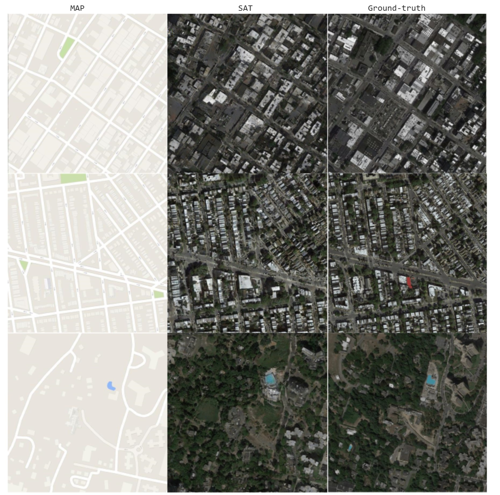

# Computervision-Pix2Pix-Map2Satellite-Image-Translation

**The computer vision course project for a map to an Aerial image translation**

* Clone this repo:

  ```shell
  git clone https://github.com/kamyabazizi/Computervision-Pix2Pix-MaptoSatellite-Image-Translation.git
  cd Computervision-Pix2Pix-MaptoSatellite-Image-Translation
  ```
  
* Install [PyTorch](https://pytorch.org) 1.4 and other dependencies (e.g., torchvision).

  ```shell
  pip install -r requirements.txt
  ```
  
* Download the pix2pix dataset. (Map2Sat, 2194 images scraped from Google Maps)

  ```shell
  bash datasets/download_pix2pix_dataset.sh maps
  ```

* Download the original model of map2sat dataset. (A conditional-GAN based paired image-to-image translation model)

  ```shell
  python scripts/download_model.py --model pix2pix --task map2sat --stage full
  ```
  
* Get the options for the test.

  ```shell
  python get_test_opt.py --dataroot database/maps \
    --results_dir results-pretrained/pix2pix/map2sat/full \
    --ngf 64 --netG resnet_9blocks \
    --restore_G_path pretrained/pix2pix/map2sat/full/latest_net_G.pth \
    --real_stat_path real_stat/maps_A.npz \
    --direction BtoA \
    --need_profile --num_test 200
  ```
  
# Results

* Get visual results of the model.

  ```shell
  python main.py
  python visual.py
  ```
  
  
 <p align="center">
  
 </p>
